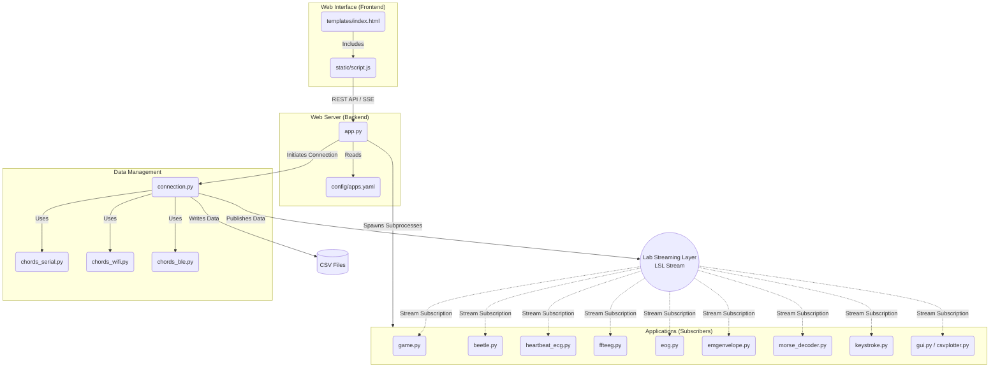

# Deep Dive: The `chordspy` Package

This document provides an in-depth review of the `chordspy` directory. This directory is the core of the **Chords-Python** framework, acting as the bridge between the hardware, data streaming, web interface, and interactive applications.

---

## Detailed Directory & File Breakdown

### 1. Core Framework Files
These files are the engine of the application, responsible for web serving and data routing.
* **`__init__.py`**: Initializes the `chordspy` module as a valid Python package.
* **`app.py`**: The main Flask-based web server application. It serves the HTML UI, exposes endpoints for connecting/disconnecting from hardware, launching applications, and uses Server-Sent Events (SSE) to push real-time terminal/console updates back to the browser.
* **`connection.py`**: The unified data broker. This script abstracts away the specific hardware protocols. It is responsible for initializing Lab Streaming Layer (LSL) streams, recording data streams to CSV, and automatically discovering hardware devices. 

### 2. Protocol Handlers
These scripts contain the low-level logic to connect, read, and parse data packets from Chords Arduino boards.
* **`chords_ble.py`**: Handles Bluetooth Low Energy (BLE) connections using the `bleak` library. It connects to the hardware's BLE characteristics to subscribe to data notifications.
* **`chords_serial.py`**: Uses `pyserial` to communicate over USB/Serial ports, configuring baud rates and reading data streams directly from COM ports.
* **`chords_wifi.py`**: Implements TCP/UDP sockets to connect to a Wi-Fi enabled Chords device, parsing data packets sent over the local network.

### 3. Applications & Signal Processing
These are standalone scripts that "subscribe" to the LSL data stream provided by `connection.py` to achieve specific tasks.
* **`beetle.py`**: A focus-based game utilizing EEG data (Brainpower bands).
* **`double_triple_blink.py`**: Parses EOG (Eye) signals and uses thresholding logic to detect double and triple blink patterns.
* **`emgenvelope.py`**: Visualizes raw EMG (Muscle) data and calculates the signal envelope in real-time to track muscle activation intensity.
* **`eog.py`**: A real-time plotting application for EOG signals that actively marks detected blinks with visual cues (like red dots) on the graph.
* **`ffteeg.py`**: A complex EEG visualization tool that applies Fast Fourier Transform (FFT) algorithms on raw EEG data to extract and display frequency bands (Delta, Theta, Alpha, Beta, Gamma).
* **`game.py`**: A 2-player competitive "Tug of War" game driven by the relative focus (EEG) of two users.
* **`heartbeat_ecg.py`**: Analyzes ECG (Heart) signals, detects R-peaks in the QRS complex, and calculates Beats Per Minute (BPM) in real-time.
* **`keystroke.py`**: An accessibility tool that acts as a Keystroke Emulator, detecting blinks via EOG and programmatically simulating keyboard events (like hitting the spacebar).
* **`morse_decoder.py`**: Translates left/right eye movements and blinks from EOG signals into Morse code characters and decodes them into text.

### 4. Utilities
* **`gui.py`**: A raw data visualizer that plots the incoming LSL streams in real-time without applying complex signal processing.
* **`csvplotter.py`**: A post-processing tool designed to load, parse, and plot data from the saved `.csv` files for retrospective analysis.

### 5. Subdirectories
* **`config/`**
  * **`apps.yaml`**: A configuration file used by `app.py`. It dynamically populates the web interface with the available applications (defining the app name, description, and the python script to execute).
* **`static/`**
  * **`script.js`**: The frontend JavaScript for the web interface. It handles asynchronous button clicks (Connect, Launch App) and processes the Server-Sent Events (SSE) to update the virtual terminal in the browser.
* **`templates/`**
  * **`index.html`**: The main HTML file rendered by Flask. It contains the layout, CSS styling, and structure of the Chords-Python web dashboard.
* **`media/`**: Contains static visual and audio assets (e.g., `.png` icons, `.mp3` sound effects) used by the web interface and interactive games.
* **`notebooks/`**: A folder containing Jupyter Notebooks (`.ipynb`), typically used by developers for prototyping signal processing algorithms before integrating them into the main `.py` apps.
* **`test/`**
  * **`new_parser.py`**: A script used for testing and validating new data parsing logic before it gets merged into the primary protocol handlers.

---

## `chordspy` Internal Architecture Diagram

This Mermaid diagram illustrates the internal relationship between the files within the `chordspy` module.

