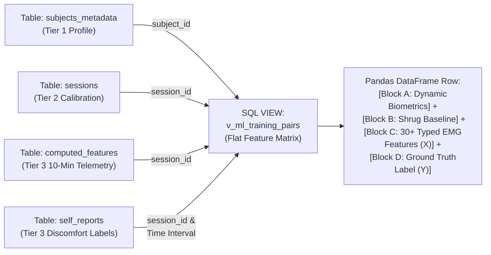

# TensionBudget Cloud Database & Machine Learning Schema Specification

This document serves as the authoritative, definitive blueprint for the **TensionBudget Cloud PostgreSQL Database Schema and Machine Learning Data Architecture**. It details every relational table, attribute data type, physical physiological purpose, foreign key linkage, and machine learning feature vector transformation required for multi-user cloud deployment and longitudinal ergonomic modeling.

---

## 1. Architectural Foundation & Non-Negotiable Principles

1. **The Source of Truth & Zero DSP Rewrite**: All mathematical digital signal processing (DSP), filtering, baseline extraction, and analytical scoring remain strictly governed by the verified Python local package (`chordspy.tensionbudget`). In web execution, these exact algorithms run unmodified inside **Pyodide WebAssembly**.
2. **The Two-Clock Principle**:
   * **Clock 1 (High-Speed In-Memory Clock)**: Operates entirely inside client browser RAM at 500 Hz sample processing and 50 Hz UI rendering. Never touches the network or cloud database.
   * **Clock 2 (10-Minute Discrete Summary Clock)**: Exactly once every completed 10-minute work window (and upon session teardown), a comprehensive feature vector is pushed via POST to the cloud API and appended to PostgreSQL.
3. **Raw Signal Non-Persistence**: Raw 500 Hz surface electromyography (sEMG) streams exist strictly in temporary client memory for real-time calculation and visualization. They **do not upload to the server** and vanish upon browser tab closure.
4. **Structural Privacy & Auth Isolation**: To comply with modern privacy standards, login credentials are structurally separated from biomedical research datasets. Authentication tables issue an anonymized `subject_id` (UUID); biomedical tables key exclusively on this `subject_id` without storing names or email addresses.

---

## 2. The 3-Tier Relational Database Hierarchy

```mermaid
erDiagram
    auth_users {
        string email PK
        string password_hash
        uuid subject_id UK "Isolated Bridge"
        timestamp created_at
    }
    subjects_metadata {
        uuid subject_id PK_FK "References auth_users"
        date birth_date
        string gender_sex "M, F, Other, Unspecified"
        real weight_kg "Nullable"
        real height_cm "Nullable"
        timestamp updated_at
    }
    sessions {
        int session_id PK "SERIAL"
        uuid subject_id FK "References subjects_metadata (Indexed)"
        timestamp start_time
        timestamp end_time
        real calibration_rms_left "5s Shrug Baseline (mV)"
        real calibration_rms_right "5s Shrug Baseline (mV)"
        string status "active, completed, aborted"
    }
    computed_features {
        int feature_id PK "SERIAL"
        int session_id FK "References sessions (Indexed)"
        int epoch_index "Window #1, #2..."
        timestamp timestamp
        real composite_score
        real eindex_live_left
        real short_suma_penalty_left
        real mdf_hz_left "Nullable"
        boolean mdf_computed_left "Explicit Missingness Indicator"
    }
    self_reports {
        int report_id PK "SERIAL"
        int session_id FK "References sessions (Indexed)"
        timestamp timestamp
        int perceived_exertion_rating "RPE Score 1-10"
        string discomfort_location
    }
    alert_events {
        int alert_id PK "SERIAL"
        int session_id FK "References sessions (Indexed)"
        timestamp timestamp
        string alert_type
        real trigger_value
    }
    personalization_state {
        int state_id PK
        uuid subject_id UK_FK "References subjects_metadata (Indexed)"
        real custom_eindex_high
        real custom_short_suma_cap
        real custom_asymmetry_tolerance
        timestamp last_model_retrain
    }

    auth_users ||--|| subjects_metadata : "issues anonymous subject_id"
    subjects_metadata ||--o{ sessions : "participates in many"
    subjects_metadata ||--|| personalization_state : "governed by 1 custom profile"
    sessions ||--o{ computed_features : "logs features every 10 mins"
    sessions ||--o{ self_reports : "collects discomfort labels"
    sessions ||--o{ alert_events : "records postural alarms"
```

---

## 3. Exhaustive Table & Attribute Specifications

### Tier 1: The Privacy & Identity Firewall

#### Table 1: `auth_users`
Stores sensitive personally identifiable information (PII) required strictly for user login and account security.
| Column Name | SQL Type | Nullable? | Key / Constraint | Physiological & Engineering Purpose |
| :--- | :--- | :--- | :--- | :--- |
| `email` | `VARCHAR(255)` | **No** | **PRIMARY KEY** | User login handle and communication contact. Never accessed by analytical or ML scripts. |
| `password_hash` | `VARCHAR(255)` | **No** | — | Cryptographically hashed password (e.g., Argon2id or bcrypt). |
| `subject_id` | `UUID` | **No** | **UNIQUE INDEX** | Randomly generated immutable UUID value acting as the anonymous bridge to biomedical tables. |
| `created_at` | `TIMESTAMP` | **No** | `DEFAULT CURRENT_TIMESTAMP` | Account creation timestamp. |

#### Table 2: `subjects_metadata` (De-Identified Research Vault)
Stores longitudinal human biological physical traits. Contains zero PII. Keyed strictly by `subject_id`.
| Column Name | SQL Type | Nullable? | Key / Constraint | Physiological & Engineering Purpose |
| :--- | :--- | :--- | :--- | :--- |
| `subject_id` | `UUID` | **No** | **PK / FK $\rightarrow$ auth_users(subject_id)** ON DELETE CASCADE | Primary research identifier for longitudinal analysis. |
| `birth_date` | `DATE` | **No** | — | User's date of birth (YYYY-MM-DD). Used to dynamically calculate biological age at any session date without manual field updates. |
| `gender_sex` | `VARCHAR(16)` | **No** | `CHECK (gender_sex IN ('M', 'F', 'Other', 'Unspecified'))` | Biological sex/gender. Critical feature because baseline muscle cross-sectional area and motor unit firing rates vary across biological sex. |
| `weight_kg` | `REAL` | Yes | `CHECK (weight_kg > 0 OR NULL)` | Physical body weight in kilograms. Influences structural postural gravitational loading on the upper trapezius. |
| `height_cm` | `REAL` | Yes | `CHECK (height_cm > 0 OR NULL)` | Physical height in centimeters. Required alongside weight to dynamically evaluate Body Mass Index (BMI). |
| `created_at` | `TIMESTAMP` | **No** | `DEFAULT CURRENT_TIMESTAMP` | Profile generation timestamp. |
| `updated_at` | `TIMESTAMP` | **No** | `DEFAULT CURRENT_TIMESTAMP` | Timestamp of last physical trait modification. |

> [!NOTE]
> **Dynamic Biometric Computations (No Stale Integers)**:
> Whenever database views or queries retrieve user metadata, **Age** and **Body Mass Index (BMI)** are evaluated dynamically in real-time SQL:
> - **Dynamic Age (Years)**: `ROUND(EXTRACT(YEAR FROM AGE(session.timestamp, subjects_metadata.birth_date))::numeric, 1)`
> - **Dynamic BMI ($kg/m^2$)**: `ROUND((subjects_metadata.weight_kg / POWER(subjects_metadata.height_cm / 100.0, 2))::numeric, 2)`

---

### Tier 2: Working Sitting & Personal Baseline Calibration

#### Table 3: `sessions`
Records the overarching parameters, timing, and personal baseline sensitivity of an individual monitoring sitting.
| Column Name | SQL Type | Nullable? | Key / Constraint | Physiological & Engineering Purpose |
| :--- | :--- | :--- | :--- | :--- |
| `session_id` | `SERIAL` (`INTEGER`) | **No** | **PRIMARY KEY** | Unique incremental integer identifying a single workstation sitting. |
| `subject_id` | `UUID` | **No** | **FK $\rightarrow$ subjects_metadata(subject_id)** INDEXED | Links the sitting to the anonymous human biological profile. |
| `start_time` | `TIMESTAMP` | **No** | `DEFAULT CURRENT_TIMESTAMP` | Exact chronological start timestamp of data recording. |
| `end_time` | `TIMESTAMP` | Yes | — | Exact chronological termination timestamp (populated on graceful stop or tab close). |
| `calibration_rms_left` | `REAL` | **No** | `CHECK (calibration_rms_left > 0)` | **Personal Left Baseline**: Middle-3-second average voltage (mV) recorded during the initial 5-second submaximal shoulder shrug test. |
| `calibration_rms_right` | `REAL` | **No** | `CHECK (calibration_rms_right > 0)` | **Personal Right Baseline**: Middle-3-second average voltage (mV) recorded during the initial 5-second submaximal shoulder shrug test. |
| `status` | `VARCHAR(32)` | **No** | `DEFAULT 'active'` | Lifecycle tracker: `'active'`, `'completed'`, or `'aborted'`. |

---

### Tier 3: The 10-Minute Longitudinal Telemetry Logs

#### Table 4: `computed_features` (Flattened Wide Tabular Format)
The primary analytical telemetry store. Exactly **one row per 10-minute work epoch** is inserted here from session initiation until session termination. Designed explicitly as a flat, typed columnar table for instantaneous ingestion by tabular machine learning engines.

| Column Group | Column Name | SQL Type | Nullable? | Physiological & Engineering Purpose |
| :--- | :--- | :--- | :--- | :--- |
| **Metadata** | `feature_id` | `SERIAL` | **No (PK)** | Unique identifier for this discrete epoch snapshot. |
| | `session_id` | `INTEGER` | **No (FK INDEX)** | Foreign key linking this epoch to `sessions(session_id)`. |
| | `epoch_index` | `INTEGER` | **No** | Sequential window order (`1` = 0–10 min, `2` = 10–20 min, etc.). |
| | `timestamp` | `TIMESTAMP` | **No** | Exact time when this 10-minute window completed. |
| | `elapsed_minutes`| `REAL` | **No** | Cumulative working minutes since session start (e.g., `10.0`, `20.0`). |
| **Composite & Load** | `composite_score` | `REAL` | **No** | Combined overall ergonomic warning rating (`0.0` to `3.0`). Driven by worst-side physical stress minus asymmetry penalty. |
| | `eindex_live_left` / `right` | `REAL` / `REAL` | **No** / **No** | Proportionate physical exposure score (`-2.0` to `+2.0`) over the 10-minute epoch (Koch 2024 formula). |
| | `eindex_cumulative_left` / `right` | `REAL` / `REAL` | **No** / **No** | Running daily accumulation of physical load across completed 10-minute windows in this sitting. |
| **Event Counts & APDF** | `short_suma_penalty_left` / `right` | `REAL` / `REAL` | **No** / **No** | Cinderella-fiber strain penalty (`0.0` to `1.0`). Quantifies low-load contractions sustained between 1.5–10s without rest. |
| | `total_suma_bursts_left` / `right` | `INTEGER` / `INTEGER`| **No** / **No** | Total count of uninterrupted sustained muscle activity events detected in the window. |
| | `gap_frequency_left` / `right` | `REAL` / `REAL` | **No** / **No** | Average physiological recovery rate, measured in complete relaxation gaps per minute (`<3% RVE` for `>=0.2s`). |
| | `apdf_10_left` / `right` | `REAL` / `REAL` | **No** / **No** | Static muscular effort level (10th percentile of amplitude distribution) in `%RVE`. |
| | `apdf_50_left` / `right` | `REAL` / `REAL` | **No** / **No** | Median muscular effort level (50th percentile of amplitude distribution) in `%RVE`. |
| | `apdf_90_left` / `right` | `REAL` / `REAL` | **No** / **No** | Peak muscular contraction effort level (90th percentile of amplitude distribution) in `%RVE`. |
| **Posture Symmetry** | `asymmetry_index_ai` | `REAL` | Yes (NULL if resting) | Signed Laterality Index (`-1.0` to `+1.0`) comparing Left vs. Right median loads. `0.0` is perfect posture symmetry. |
| | `asymmetry_penalty_applied` | `BOOLEAN`| **No** | `TRUE` if `\|AI\| > 0.5`, indicating severe postural tilt that subtracted points from the composite score. |
| **Spectral Fatigue & Missingness** | `mdf_hz_left` / `right` | `REAL` / `REAL` | **Yes (Nullable)** | Median Power Frequency (Hz) of pre-rectified EMG power spectrum via Welch's method. |
| | `mnf_hz_left` / `right` | `REAL` / `REAL` | **Yes (Nullable)** | Mean Power Frequency (Hz) centroid of power spectrum. |
| | `fatigue_slope_left` / `right` | `REAL` / `REAL` | **Yes (Nullable)** | OLS linear regression rate of frequency shift (`Hz/min`) over the window. Negative values show fatigue. |
| | **`mdf_computed_left` / `right`**| **`BOOLEAN` / `BOOLEAN`** | **No (DEFAULT FALSE)** | **Explicit Missingness Indicator**: `TRUE` if active contractions occurred and spectral metrics were computed; `FALSE` if muscle was relaxed. Prevents ML algorithms from imputing uncomputed periods as `0 Hz`. |
| | `is_fatiguing_left` / `right`| `BOOLEAN` / `BOOLEAN`| **No (DEFAULT FALSE)** | `TRUE` if spectral downward slope exceeds threshold (`< -0.3 Hz/min`) with strong linear fit quality ($R^2 \ge 0.3$). |

---

#### Table 5: `self_reports` (Ground-Truth Target Labels $Y$)
Records subjective human perceived exertion and physical comfort ratings submitted during or directly after a monitoring window. Serves as the supervisory ground-truth learning target for ML training models.
| Column Name | SQL Type | Nullable? | Key / Constraint | Physiological & Engineering Purpose |
| :--- | :--- | :--- | :--- | :--- |
| `report_id` | `SERIAL` | **No** | **PRIMARY KEY** | Unique integer identifier for the discomfort report submission. |
| `session_id` | `INTEGER` | **No** | **FK $\rightarrow$ sessions(session_id)** INDEXED | Ties the comfort label to the exact active workstation sitting. |
| `timestamp` | `TIMESTAMP` | **No** | `DEFAULT CURRENT_TIMESTAMP` | Exact time when the user submitted their rating. |
| `perceived_exertion_rating` | `INTEGER` | **No** | `CHECK (perceived_exertion_rating BETWEEN 1 AND 10)` | Borg Rating of Perceived Exertion (RPE) on a 1–10 scale (`1` = complete effortless rest, `10` = unbearable fatigue/pain). |
| `discomfort_location` | `VARCHAR(64)` | Yes | — | Specific anatomical site of discomfort (e.g., `'Left Trapezius'`, `'Right Neck'`, `'Upper Back'`). |

#### Table 6: `alert_events`
Asychronously logs real-time warning alarms generated whenever live biometric indicators violate safe ergonomic tolerance boundaries.
| Column Name | SQL Type | Nullable? | Key / Constraint | Physiological & Engineering Purpose |
| :--- | :--- | :--- | :--- | :--- |
| `alert_id` | `SERIAL` | **No** | **PRIMARY KEY** | Unique integer identifier for the fired alarm event. |
| `session_id` | `INTEGER` | **No** | **FK $\rightarrow$ sessions(session_id)** INDEXED | Ties the warning alarm to the active work session. |
| `timestamp` | `TIMESTAMP` | **No** | `DEFAULT CURRENT_TIMESTAMP` | Exact real-time occurrence timestamp when the alarm fired. |
| `alert_type` | `VARCHAR(64)` | **No** | — | Type of ergonomic infraction: `'ASYMMETRY_IMBALANCE'`, `'FATIGUE_SLOPE_WARNING'`, or `'CINDERELLA_STRAIN'`. |
| `trigger_value`| `REAL` | **No** | — | The observed physiological value that triggered the warning alarm (e.g., AI = `+0.72` or MDF slope = `-0.45 Hz/min`). |
| `threshold_value`| `REAL` | **No** | — | The governing tolerance threshold that was breached (e.g., `+0.50` or `-0.30`). |

#### Table 7: `personalization_state`
Stores per-user personalized alert thresholds dynamically calibrated and updated by the nightly offline ML Personalization Engine.
| Column Name | SQL Type | Nullable? | Key / Constraint | Physiological & Engineering Purpose |
| :--- | :--- | :--- | :--- | :--- |
| `state_id` | `SERIAL` | **No** | **PRIMARY KEY** | Unique identifier for the personalization profile state. |
| `subject_id` | `UUID` | **No** | **UK / FK $\rightarrow$ subjects_metadata(subject_id)** INDEXED | Ensures exactly one active personalized threshold state per subject. |
| `custom_eindex_high` | `REAL` | **No** | `DEFAULT 7.0` | Custom physical high-load exposure percentage threshold (defaults to Koch 2024 baseline of `7% MVE`). |
| `custom_short_suma_cap` | `REAL` | **No** | `DEFAULT 1.0` | Custom Cinderella-fiber fragmentation ceiling before maximum penalty triggers. |
| `custom_asymmetry_tolerance`| `REAL` | **No** | `DEFAULT 0.5` | Custom posture tilt tolerance before asymmetry penalty activates. |
| `last_model_retrain` | `TIMESTAMP` | **No** | `DEFAULT CURRENT_TIMESTAMP` | Chronological timestamp of the most recent ML model update run. |

---

## 4. The Machine Learning Training Matrix & SQL View (`v_ml_training_pairs`)

To train supervised ML algorithms (such as XGBoost, LightGBM, Random Forests, or Ridge Regression) to accurately predict individual human fatigue and customize alert thresholds, data across isolated database tables must be consolidated into a flat **Tabular Feature Matrix**.

We establish a permanent PostgreSQL database view named **`v_ml_training_pairs`**. When queried via Python (`pandas.read_sql("SELECT * FROM v_ml_training_pairs WHERE subject_id = ...")`), this view performs automated multi-table joins and exports clean training pairs ($X_i \rightarrow Y_i$).

### Anatomy of the Consolidated ML Feature Matrix



#### Exhaustive Block-by-Block ML Feature Vector Breakdown:
* **Block A: Subject Profile & Dynamic Biometrics (Context Feature Vectors $X_{\text{user}}$)**
  * Originates from `subjects_metadata` via `subject_id` JOIN.
  * Columns: `subject_id`, `gender_sex` (One-hot encoded in ML), `age_years` (Dynamically calculated via SQL against epoch timestamp), `bmi_value` (Dynamically calculated via SQL from weight and height).
  * *ML Justification*: Baseline EMG firing amplitudes, skinfold thickness impedance, and muscular endurance differ across age, sex, and BMI. These structural biometric features normalize inter-subject biological diversity!
* **Block B: Personal Session Shrug Baseline (Sensitivity Scaling Vectors $X_{\text{calib}}$)**
  * Originates from `sessions` via `session_id` JOIN.
  * Columns: `session_id`, `calibration_rms_left` (mV), `calibration_rms_right` (mV).
  * *ML Justification*: Supplies the exact electrical gain setting established during the initial 5-second shoulder shrug for that specific sitting.
* **Block C: 10-Minute Longitudinal Ergonomic Telemetry (Primary Predictive Features $X_{\text{telemetry}}$)**
  * Originates from `computed_features`.
  * Columns: All 30+ explicit typed SQL columns (`composite_score`, `eindex_live_left/right`, `eindex_cumulative_left/right`, `short_suma_penalty_left/right`, `total_suma_bursts_left/right`, `gap_frequency_left/right`, `apdf_10/50/90_left/right`, `asymmetry_index_ai`, `mdf_hz_left/right`, `fatigue_slope_left/right`, and explicitly `mdf_computed_left/right`).
  * *ML Justification*: Quantifies physical load, Cinderella fiber fatigue, relaxation opportunities, posture tilt, and frequency conduction velocity slowdown over those exact 10 minutes.
* **Block D: Ground-Truth Supervisory Target Label (Target Vector $Y$)**
  * Originates from `self_reports` via `session_id` and temporal matching (matching subjective comfort ratings submitted within or adjacent to the 10-minute feature window).
  * Columns: `perceived_exertion_rating` (Integer 1–10 RPE score), `discomfort_location`.
  * *ML Justification*: This is the supervisory learning target ($Y$). The algorithm evaluates Blocks A, B, and C ($X$) to determine which specific physiological signal combinations reliably predict high subjective perceived exertion or localized discomfort in Block D!

### Official DDL Schema Statement for `v_ml_training_pairs`:
```sql
CREATE OR REPLACE VIEW v_ml_training_pairs AS
SELECT 
    -- Block A: Subject Biometrics & Dynamic SQL Evaluation
    sub.subject_id,
    sub.gender_sex,
    ROUND(EXTRACT(YEAR FROM AGE(f.timestamp, sub.birth_date))::numeric, 1) AS age_years,
    CASE 
        WHEN sub.weight_kg IS NOT NULL AND sub.height_cm IS NOT NULL 
        THEN ROUND((sub.weight_kg / POWER(sub.height_cm / 100.0, 2))::numeric, 2)
        ELSE NULL 
    END AS bmi_value,

    -- Block B: Personal Session Calibration Baseline
    s.session_id,
    s.calibration_rms_left,
    s.calibration_rms_right,

    -- Block C: Flattened 10-Minute Telemetry Feature Vector (X inputs)
    f.feature_id,
    f.epoch_index,
    f.timestamp AS epoch_timestamp,
    f.elapsed_minutes,
    f.composite_score,
    f.eindex_live_left,
    f.eindex_live_right,
    f.eindex_cumulative_left,
    f.eindex_cumulative_right,
    f.short_suma_penalty_left,
    f.short_suma_penalty_right,
    f.total_suma_bursts_left,
    f.total_suma_bursts_right,
    f.gap_frequency_left,
    f.gap_frequency_right,
    f.apdf_10_left,
    f.apdf_50_left,
    f.apdf_90_left,
    f.apdf_10_right,
    f.apdf_50_right,
    f.apdf_90_right,
    f.asymmetry_index_ai,
    f.asymmetry_penalty_applied,
    f.mdf_hz_left,
    f.mnf_hz_left,
    f.fatigue_slope_left,
    f.mdf_computed_left, -- Explicit Missingness Indicator
    f.is_fatiguing_left,
    f.mdf_hz_right,
    f.mnf_hz_right,
    f.fatigue_slope_right,
    f.mdf_computed_right, -- Explicit Missingness Indicator
    f.is_fatiguing_right,

    -- Block D: Ground-Truth Supervisory Target Label (Y outcome)
    r.perceived_exertion_rating,
    r.discomfort_location

FROM computed_features f
JOIN sessions s ON f.session_id = s.session_id
JOIN subjects_metadata sub ON s.subject_id = sub.subject_id
LEFT JOIN self_reports r ON f.session_id = r.session_id 
    AND r.timestamp BETWEEN (f.timestamp - INTERVAL '10 minutes') AND (f.timestamp + INTERVAL '2 minutes');
```

---

## 5. Machine Learning Protocols & Retrieval Efficiency

1. **Chronological Data Splitting (Preventing Autocorrelation Leakage)**:
   * Muscle fatigue and physical stress accumulate gradually across consecutive working hours and successive days, causing heavy temporal autocorrelation between sequential 10-minute windows.
   * **Rule**: Standard random K-Fold cross-validation or shuffling is **strictly forbidden**. Random splits leak future fatigued operational states into earlier training folds, artificially inflating validation accuracy.
   * All ML training pipelines must apply **Chronological Time-Based Splitting**: splitting training and validation folds strictly along chronological session boundaries (e.g., training on weeks 1–3, validating on week 4) per subject.
2. **Explicit Missingness Imputation Handling**:
   * Tree-based classifiers (XGBoost/LightGBM) natively accept `NULL` values when guided by explicit missingness indicator columns (`mdf_computed_left = FALSE`).
   * When preprocessing matrices for linear estimators (such as Ridge Regression or Support Vector Machines), uncomputed spectral frequencies (`mdf_hz = NULL`) must never be imputed with `0.0 Hz`. Imputation must use the subject's baseline resting frequency or historical median, paired directly with the explicit `mdf_computed` boolean weight.
3. **Retrieval Scale & Zero Over-Engineering**:
   * For our expected ergonomic pilot cohort of 12–15 human subjects over multi-week observational trials, the dataset will encompass several thousand rows.
   * Deploying feature stores, streaming Parquet clusters, or complex distributed batching is unnecessary over-engineering. A single `pandas.read_sql("SELECT * FROM v_ml_training_pairs WHERE subject_id = ...")` command executes over indexed B-Tree paths and loads the complete user training history directly into memory in under 50 milliseconds.

---

## 6. Multi-Format Data Export & External Dataset Ingestion

Because our schema operates on an explicit wide-tabular architecture (one row per epoch, one typed column per feature), the system natively supports bi-directional data exchange across three industry-standard formats: **CSV, Excel (`.xlsx`), and JSON / JSONL**.

### Supported File Format Usage Patterns
1. **CSV (Comma-Separated Values - *Recommended for Fast ML Ingestion & Scripts*)**:
   * Lightweight ASCII text format. Standard for automated machine learning scripts, Pandas ingestion (`read_csv`), R statistical computing, and inter-system transfer.
2. **Excel (`.xlsx` - *Recommended for Manual Editing, Inspection & Charting*)**:
   * Fully formatted spreadsheet format. Ideal for human inspection, creating visual reports for ergonomic researchers, or **manually compiling and formatting external pilot study trial datasets**.
3. **JSON / JSONL (*Recommended for Cloud APIs & System Backups*)**:
   * Preserves native programming type safety (booleans as `true`/`false`, empty cells as `null`). Used for automated daily database dumps and browser REST API telemetry payload buffering.

### Automated Export & Import Ingestion Workflows
* **Manual Retrieval (Export from DB)**:
  * Through the Web UI Dashboard or simple CLI utilities, authorized researchers can query any session, subject history, or the complete `v_ml_training_pairs` view and export directly to `.csv`, `.xlsx`, or `.json` in one click.
* **Manual Addition (Importing External Datasets into the DB)**:
  * External pilot study datasets or offline trial recordings formatted in Excel or CSV matching our explicit column names (`composite_score`, `eindex_live_left`, `mdf_hz_left`, etc.) can be directly uploaded via the UI Importer dropzone or batch CLI script (`import_dataset.py`).
  * The ingestion engine verifies datatype constraints, associates rows with a target `subject_id` and calibration session, and executes batch insertions directly into PostgreSQL. The nightly ML Personalization Engine immediately treats imported external epochs as valid historical training examples, enabling rapid dataset augmentation without requiring additional live hardware recording hours!
