# TensionBudget Cloud Database & Machine Learning Schema Specification

This document serves as the authoritative, definitive blueprint for the **TensionBudget Cloud PostgreSQL Database Schema and Machine Learning Data Architecture**, fully reconciled with the canonical desktop Python DDL in `chordspy/tensionbudget/cloud_schema.py`. It details every relational table, attribute data type, physical physiological purpose, foreign key linkage, and machine learning feature vector transformation required for multi-user cloud deployment and longitudinal ergonomic modeling.

---

## 1. Architectural Foundation & Non-Negotiable Principles

1. **The Source of Truth & Zero DSP Rewrite**: All mathematical digital signal processing (DSP), filtering, baseline extraction, and analytical scoring remain strictly governed by the verified Python local package (`chordspy.tensionbudget`). In web execution, these exact algorithms run unmodified inside **Pyodide WebAssembly**.
2. **The Two-Clock Principle**:
   * **Clock 1 (High-Speed In-Memory Clock)**: Operates entirely inside client browser RAM at 500 Hz sample processing and 50 Hz UI rendering. Never touches the network or cloud database.
   * **Clock 2 (5-Minute Discrete Summary Clock)**: Exactly once every completed **5-minute work epoch** (and upon session teardown), a comprehensive 38-column feature vector is pushed via POST to the cloud API and appended to PostgreSQL. This 5-minute interval doubles ML training vector density compared to earlier 10-minute prototypes and incorporates explicit Borg CR-10 target evaluations ($y$) directly into the time-series record.
3. **Raw Signal Recoverability Policy (Scoped Exception for Web)**:
   * **Web Deployment Path (Scoped Exception)**: Raw 500 Hz surface electromyography (sEMG) streams exist strictly in temporary client browser RAM for real-time calculation and visualization. To prevent excessive residential internet bandwidth overhead and biological privacy risks, raw sample streams **do not upload to the remote server over the web bridge**. However, browser users can optionally save local snapshots via the Phase W3 Session Vault suite (downloading standardized `_raw.csv`, `_features.csv`, and `_metadata.json` archives directly to disk).
   * **Desktop Application Path (Inviolation of Phase 1 Mandate & Phase W3 Parquet Upgrade)**: For local desktop execution over USB Serial or LSL, full, raw, un-rectified, un-filtered 500 Hz sample logs remain sacred. To safeguard against data corruption during computer freezes or unexpected battery drains, raw ADC samples stream continuously to a temporary CSV file during live recording and are automatically compressed into an optimized **Parquet archive (`.parquet`)** upon calling `end_session()` (reducing disk storage requirements by 80–90%).
   * **Pure Stage-1 Raw Telemetry Schema & Relational Epoch Joins**: To keep raw files as pure physical voltage captures, sparse event indicators have been excluded. Every raw record strictly implements an untouched 5-column schema: `[sample_index, timestamp_s, epoch_index, raw_adc_left, raw_adc_right]`. Relational joining between high-frequency waveforms and processed 5-minute feature vectors is executed directly via `epoch_index`—correctly handling variable sample counts per epoch (from system jitter or lag) without timestamp math or downstream row counting. For researchers utilizing Microsoft Excel, the included `scripts/export_raw_to_excel.py` CLI utility automatically partitions large Parquet archives across multiple `.xlsx` worksheet tabs to bypass Excel's ~1,048,576 row hardware limit.
4. **Symmetrical 500 Hz Hardware Sampling Rate (COM5 & COM6)**: Both Left and Right trapezius channels must operate strictly at **500 Hz (Nyquist = 250 Hz)** to support uncompromised 20–240 Hz Butterworth bandpass filtering and Welch power spectral fatigue regression across both shoulders. Historical 250 Hz test limits on COM5 were due to test firmware prototypes and should never be reproduced.
5. **Structural Privacy & Auth Isolation**: To comply with modern privacy standards, login credentials are structurally separated from biomedical research datasets. Authentication tables issue an anonymized ID (`user_name` or `subject_id`); research tables key exclusively on this bridge identifier without storing names or email addresses.

---

## 2. The 3-Tier Relational Database Hierarchy (Canonical Schema)

```mermaid
erDiagram
    auth_users {
        string email PK
        string password_hash
        string user_name UK "Isolated Bridge ID"
        timestamp created_at
    }
    user_profiles {
        string user_name PK "Mapped from auth user_name"
        string birth_date
        string gender_sex "M, F, Other"
        real weight_kg
        real height_cm
        real updated_at
    }
    sessions {
        string session_id PK
        string user_name FK "References user_profiles"
        real start_time
        string start_time_str
        real end_time
        string end_time_str
        string mode
        real calibration_rms_left
        real calibration_rms_right
        string processing_version "phase11_edge_padding / legacy_constant_padding"
    }
    epoch_features {
        int feature_id PK
        string session_id FK "References sessions"
        int epoch_index "Window #1, #2..."
        real elapsed_minutes
        real composite_score
        real eindex_live_left
        real eindex_live_right
        real eindex_cumulative_left
        real eindex_cumulative_right
        real short_suma_penalty_left
        real short_suma_penalty_right
        real total_suma_bursts_left
        real total_suma_bursts_right
        real gap_frequency_left
        real gap_frequency_right
        real apdf_10_left
        real apdf_10_right
        real apdf_50_left
        real apdf_50_right
        real apdf_90_left
        real apdf_90_right
        real asymmetry_index_ai
        int asymmetry_penalty_applied
        real mdf_hz_left
        real mdf_hz_right
        real mnf_hz_left
        real mnf_hz_right
        real fatigue_slope_left
        real fatigue_slope_right
        real mdf_r_squared_left "Regression fit diagnostic"
        real mdf_r_squared_right "Regression fit diagnostic"
        real n_windows_left "Buffer volume verification"
        real n_windows_right "Buffer volume verification"
        int mdf_computed_left "Explicit Missingness Flag"
        int is_fatiguing_left
        int mdf_computed_right "Explicit Missingness Flag"
        int is_fatiguing_right
        int strain_reported "Boolean reporting flag (0/1)"
        real subjective_strain_cr10 "Borg CR-10 target label y (0.0-10.0 or NULL)"
    }

    auth_users ||--|| user_profiles : "issues anonymous ID"
    user_profiles ||--o{ sessions : "participates in many"
    sessions ||--o{ epoch_features : "logs features every 5 mins"
```



---

## 3. Canonical Table Specifications (Reconciled with `cloud_schema.py`)

### Tier 1: Privacy & Subject Profiles
- **`auth_users` (Login Firewall)**: Maintains sensitive login authentication (`email`, `password_hash`). Completely isolated from biological metrics; issues a unique `user_name` (or UUID) to act as an anonymous bridge.
- **`user_profiles` (Canonical Demographic Vault)**: Keyed by `user_name` (Table 1 in `cloud_schema.py`). Contains demographic and biological baseline variables:
  - `birth_date` (TEXT/DATE), `gender_sex` (TEXT), `weight_kg` (REAL), `height_cm` (REAL), and `updated_at` (REAL/TIMESTAMP).
  - Dynamic SQL calculation of current Age and Body Mass Index ($BMI = \frac{\text{weight}}{(\text{height / 100})^2}$) occurs directly within database analytical queries.

### Tier 2: Session Manifests & Baseline Calibration
- **`sessions` (Table 2 in `cloud_schema.py`)**: Establishes the session record linked to `user_profiles(user_name)`.
  - Captures exact timestamps (`start_time`, `end_time`, and ISO string representations), running mode (`mode`), and personal shrug calibration references (`calibration_rms_left`, `calibration_rms_right`).
  - **`processing_version`**: Stores the exact signal processing boundary iteration tag (e.g. `'phase11_edge_padding'` or `'legacy_constant_padding'`). This ensures downstream ML models segment or numerically adjust pre-Phase 11 zero-padded recordings when training alongside modern edge-padded data.

### Tier 3: 5-Minute Longitudinal Feature Vectors & Subjective Reports
- **`epoch_features` (Table 3 in `cloud_schema.py`)**: Stores the flattened **38-column feature vector** generated at **5-minute intervals** across active sittings.
  - Enters unique composite database constraints on `(session_id, epoch_index)`.
  - **Quality Diagnostics**: Features `mdf_r_squared_left/right` to reveal regression fit confidence and `n_windows_left/right` to verify that full-epoch buffers produced $\ge 300$ Welch windows per calculation (proving the Phase 12 buffer upgrade in production).
  - **Spectral Missingness**: Enforces SQL `NULL` values when frequency metrics cannot be evaluated during muscular resting states, while exposing explicit boolean flags (`mdf_computed_left/right`) to prevent ML training routines from falsely imputing `0 Hz` during silent periods.
  - **Bayesian Hierarchical Modeling Target Variable ($y$)**: Embeds ground-truth perceived muscular strain directly within the epoch record via `subjective_strain_cr10` (continuous 0.0–10.0 Borg scale) and an explicit boolean indicator `strain_reported` ($0$ or $1$).
    - *Rejection of Imputation & Pseudo-Replication*: If a user skips reporting during an epoch, `subjective_strain_cr10` is explicitly stored as SQL `NULL` (empty string in CSV) with `strain_reported = 0`. Both forward-fill (which would falsely inflate sample size $N$ by 150,000x across 500 Hz streams, destroying confidence intervals in Bayesian regression) and backward-fill (creating data-loss risks during unexpected disconnections) are rigorously prohibited.

---

## 4. Analytical Machine Learning View (`v_ml_training_pairs`)

To generate flattened training matrices without complex JOIN logic inside Python ETL scripts, PostgreSQL exposes an automated SQL view matching `cloud_schema.py` (explicitly excluding duplicate keys to prevent column naming collisions):

```sql
CREATE OR REPLACE VIEW v_ml_training_pairs AS
SELECT 
    s.session_id,
    s.user_name,
    u.birth_date,
    u.gender_sex,
    u.weight_kg,
    u.height_cm,
    s.calibration_rms_left,
    s.calibration_rms_right,
    s.processing_version,
    e.feature_id,
    e.epoch_index,
    e.elapsed_minutes,
    e.composite_score,
    e.eindex_live_left,
    e.eindex_live_right,
    e.eindex_cumulative_left,
    e.eindex_cumulative_right,
    e.penalty_short_suma_left,
    e.penalty_short_suma_right,
    e.asymmetry_index,
    e.asymmetry_penalty_applied,
    e.mdf_left_hz,
    e.mnf_left_hz,
    e.mdf_slope_left_hz_per_min,
    e.mnf_slope_left_hz_per_min,
    e.mdf_r_squared_left,
    e.mdf_computed_left,
    e.fatigue_flag_left,
    e.n_windows_left,
    e.mdf_right_hz,
    e.mnf_right_hz,
    e.mdf_slope_right_hz_per_min,
    e.mnf_slope_right_hz_per_min,
    e.mdf_r_squared_right,
    e.mdf_computed_right,
    e.fatigue_flag_right,
    e.n_windows_right,
    e.strain_reported,
    e.subjective_strain_cr10
FROM epoch_features e
JOIN sessions s ON e.session_id = s.session_id
LEFT JOIN user_profiles u ON s.user_name = u.user_name;
```

---

## 5. Synchronization Architecture & Team Collaboration Setup

1. **Firewall-Immune HTTPS Transport (Port 443 Default)**: Enterprise and academic campus Wi-Fi networks frequently block direct PostgreSQL database ports (`5432`/`6543`). To ensure uninterrupted telemetry synchronization in all laboratory and clinical environments, both Desktop synchronization hooks (`cloud_ingest.py`, `local_logger.py`, `ingest_to_postgres.py`) and Web applications transmit JSON payloads over standard **HTTPS (Port 443)** to our serverless Supabase Edge Function Gateway (`ingest-session`). Direct database connections remain available strictly as an optional fallback via `--direct`.
2. **Idempotency Guarantee**: All ingestion routes implement explicit `{ onConflict: "session_id,epoch_index" }` database upsert logic. Retrying failed syncs or uploading redundant folders will cleanly overwrite existing records without raising constraint violations or generating duplicates.
3. **Collaborator Credential Security (`.env` Auto-Loader)**: To enable multi-developer data ingestion without exposing API secrets in git commits, developers duplicate `.env.example` as `.env` (ignored in `.gitignore`) and input the public project Anon Key. The Python runtime package (`TBConfig`) automatically loads `.env` variables into memory on startup without requiring external environment variable configuration in PowerShell.
4. **Offline Disk-First Storage**: Local offline storage under `output_logs/` remains the unconditional primary record. The application makes zero network calls during live recordings, persisting feature CSVs, metadata manifests, and compressed Parquet waveform files directly to disk before executing background cloud synchronization.

