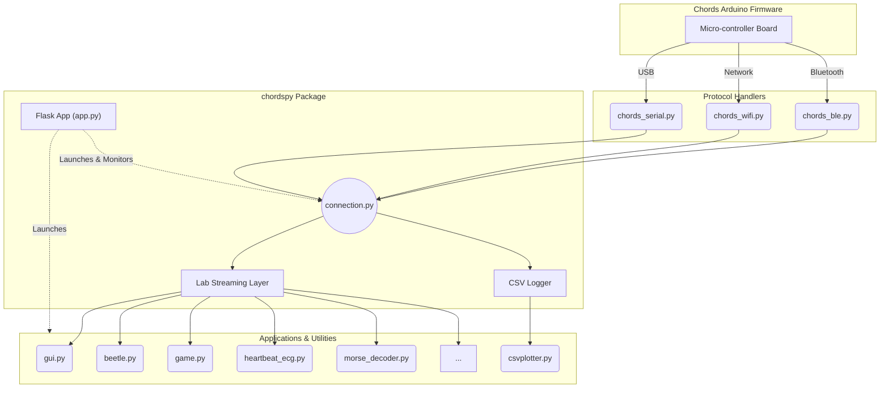

# Chords-Python Codebase Map

This document provides a comprehensive map of the `Chords-Python` project, outlining the directory structure and explaining the purpose of each file. 

## Directory Structure & File Descriptions

### Root Directory: `Chords-Python-main/`
The root directory contains project-level configurations, documentation, and the main source code package.

* **`.github/`**: Contains GitHub-specific files such as issue templates or Actions workflows.
* **`.gitignore`**: Specifies intentionally untracked files that Git should ignore.
* **`LICENSE`**: The open-source license for the project.
* **`MANIFEST.in`**: Specifies which non-Python files to include in the distribution when building the package.
* **`pyproject.toml` & `requirements.txt`**: Define project metadata, build system requirements, and Python dependencies.
* **`README.md`**: Main documentation providing an overview of features, installation steps, and usage guide.

### Source Code Package: `chordspy/`
This is the core Python package containing the connection logic, web interface, and all the bio-signal applications.

#### Core Functionality & Web Interface
* **`__init__.py`**: Marks the directory as a Python package.
* **`app.py`**: The main Flask-based web server. It provides the web interface (GUI) to scan/connect to devices via different protocols, manage LSL streaming, record data, and launch various applications.
* **`connection.py`**: A unified connection manager that wraps around specific protocols. It handles the Lab Streaming Layer (LSL) stream creation, automatic device discovery, and CSV recording.

#### Protocol Handlers
These files handle the low-level communication with the CHORDS Arduino hardware.
* **`chords_serial.py`**: Handles communication via USB / Serial port.
* **`chords_wifi.py`**: Handles wireless communication over a Wi-Fi network.
* **`chords_ble.py`**: Handles wireless communication over Bluetooth Low Energy (BLE).

#### Utility Tools
* **`gui.py`**: A standalone graphical user interface to visualize raw bio-signal data in real-time.
* **`csvplotter.py`**: A tool to load and plot data that was previously recorded and saved into CSV files.

#### Applications (Bio-signal Processing & Games)
These scripts consume the LSL stream to process specific bio-signals (EEG, ECG, EMG, EOG) and drive interactive applications.
* **`beetle.py`**: A real-time EEG focus-based game (Beetle game).
* **`double_triple_blink.py`**: Processes EOG signals to detect specific double or triple blink patterns.
* **`emgenvelope.py`**: Visualizes real-time EMG (Electromyography) signals along with their computed envelope.
* **`eog.py`**: Real-time EOG (Electrooculography) signal visualization that marks detected blinks (e.g., as red dots).
* **`ffteeg.py`**: Real-time EEG visualization that performs Fast Fourier Transform (FFT) to extract and display brainpower bands (Alpha, Beta, etc.).
* **`game.py`**: A 2-player EEG-based "Tug of War" game driven by brain activity.
* **`heartbeat_ecg.py`**: Real-time ECG visualization with heartbeat detection and BPM (Beats Per Minute) calculation.
* **`keystroke.py`**: An EOG Keystroke Emulator that detects blinks and triggers keyboard events (like hitting the spacebar).
* **`morse_decoder.py`**: Converts blinks and eye movements from EOG signals into Morse code.

#### Supporting Directories
* **`config/`**: Contains YAML configuration files (e.g., `apps.yaml`) used to define application settings and UI layouts.
* **`media/`**: Stores assets like images and audio files used in the web interface and games.
* **`notebooks/`**: Jupyter Notebooks likely used for research, prototyping signal processing algorithms, or data analysis.
* **`static/`**: Static web assets (CSS, JavaScript) used by the Flask application (`app.py`).
* **`templates/`**: HTML templates rendered by the Flask application.
* **`test/`**: Contains testing scripts for validating functionality.

---

## Architecture Diagram

The following Mermaid diagram illustrates the high-level architecture of the `Chords-Python` project, showing how hardware data flows into the web interface and applications.

