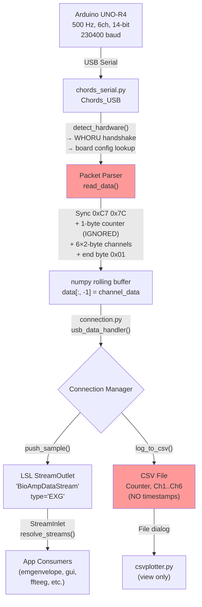

# Phase 1 — Repository Verification and Architecture Mapping

## 1. Verification Phase Completed

Full source inspection of the Chords-Python repository is **complete**. Every file referenced in the prompt's provisional map has been read in its entirety, plus several additional files (test parser, notebooks listing, static assets, templates, existing `tensionbudget/` directory, existing session log).

---

## 2. Repository Files Inspected

| File / Directory | Inspected | Notes |
|---|---|---|
| `README.md` | ✅ | |
| `pyproject.toml` | ✅ | Poetry-based build, pinned deps |
| `requirements.txt` | ✅ | Mirrors pyproject.toml |
| `chordspy/__init__.py` | ✅ | Exports `main` and `Connection` |
| `chordspy/app.py` | ✅ | Flask server, 368 lines |
| `chordspy/connection.py` | ✅ | Connection manager, 694 lines |
| `chordspy/chords_serial.py` | ✅ | USB protocol handler, 280 lines |
| `chordspy/chords_wifi.py` | ✅ (listed) | WiFi handler — out of scope |
| `chordspy/chords_ble.py` | ✅ (listed) | BLE handler — out of scope |
| `chordspy/emgenvelope.py` | ✅ | EMG visualizer, 146 lines |
| `chordspy/csvplotter.py` | ✅ | Tkinter + Plotly CSV viewer, 108 lines |
| `chordspy/gui.py` | ✅ | Raw LSL visualizer, 131 lines |
| `chordspy/config/apps.yaml` | ✅ | 10 apps registered |
| `chordspy/test/new_parser.py` | ✅ | Older parser prototype, 353 lines |
| `chordspy/tensionbudget/__init__.py` | ✅ | **Pre-existing from prior attempt** |
| `chordspy/tensionbudget/config.py` | ✅ | **Pre-existing from prior attempt** |
| `chordspy/tensionbudget/session.py` | ✅ | **Pre-existing from prior attempt** |
| `chordspy/static/script.js` | ✅ (listed) | Frontend JS |
| `chordspy/templates/index.html` | ✅ (listed) | Dashboard HTML |
| `chordspy/notebooks/` | ✅ (listed) | `ecg.ipynb`, `emg.ipynb`, `eog.ipynb` |
| `logs/session_log.md` | ✅ | Prior Phase 1 log entry |

---

## 3. Verified Architecture Map

### Root-level

| File | Purpose |
|---|---|
| [pyproject.toml](file:///c:/Users/mohit/Downloads/Chords-Python-main/Chords-Python-main/pyproject.toml) | Poetry build config; entry point `chordspy.app:main`; pinned deps including numpy, scipy, pandas, pylsl, pyserial, Flask, PyQt5 |
| [requirements.txt](file:///c:/Users/mohit/Downloads/Chords-Python-main/Chords-Python-main/requirements.txt) | Pip-style mirror of pyproject.toml dependencies |

### Core package: `chordspy/`

| File | Purpose |
|---|---|
| [__init__.py](file:///c:/Users/mohit/Downloads/Chords-Python-main/Chords-Python-main/chordspy/__init__.py) | Package init; re-exports `main` (from `app.py`) and `Connection` (from `connection.py`) |
| [app.py](file:///c:/Users/mohit/Downloads/Chords-Python-main/Chords-Python-main/chordspy/app.py) | Flask web server: dashboard, SSE console, device connect/disconnect, CSV record start/stop, app launching via `subprocess.Popen` |
| [connection.py](file:///c:/Users/mohit/Downloads/Chords-Python-main/Chords-Python-main/chordspy/connection.py) | Unified connection broker: wraps USB/WiFi/BLE handlers; creates LSL `StreamOutlet`; handles CSV recording (start/stop/log); manages data handler threads per protocol |
| [chords_serial.py](file:///c:/Users/mohit/Downloads/Chords-Python-main/Chords-Python-main/chordspy/chords_serial.py) | USB serial handler: auto-detect hardware via `WHORU` command; binary packet parser with sync bytes; board config table with sampling rates, channel counts, and resolutions; rolling numpy data buffer |
| [emgenvelope.py](file:///c:/Users/mohit/Downloads/Chords-Python-main/Chords-Python-main/chordspy/emgenvelope.py) | PyQt5 + pyqtgraph real-time EMG viewer: 4th-order Butterworth high-pass at 70 Hz; moving RMS envelope; **processes only channel 0** |
| [csvplotter.py](file:///c:/Users/mohit/Downloads/Chords-Python-main/Chords-Python-main/chordspy/csvplotter.py) | Tkinter file-picker + Plotly plotting; reads CSVs, expects `Counter` + `ChannelN` columns |
| [gui.py](file:///c:/Users/mohit/Downloads/Chords-Python-main/Chords-Python-main/chordspy/gui.py) | Raw multi-channel LSL visualizer (pyqtgraph); no signal processing |
| [config/apps.yaml](file:///c:/Users/mohit/Downloads/Chords-Python-main/Chords-Python-main/chordspy/config/apps.yaml) | YAML registry of 10 apps with title, icon, color, script name, description, category |

### Pre-existing TensionBudget attempt: `chordspy/tensionbudget/`

| File | Purpose | Status |
|---|---|---|
| [__init__.py](file:///c:/Users/mohit/Downloads/Chords-Python-main/Chords-Python-main/chordspy/tensionbudget/__init__.py) | Imports `TBConfig`, `TBSession`, `TBRecorder` | ⚠️ **Broken** — imports `TBRecorder` from `recorder.py` which does not exist |
| [config.py](file:///c:/Users/mohit/Downloads/Chords-Python-main/Chords-Python-main/chordspy/tensionbudget/config.py) | Central config class with Stage 1/2/3 placeholders | Has issues (see below) |
| [session.py](file:///c:/Users/mohit/Downloads/Chords-Python-main/Chords-Python-main/chordspy/tensionbudget/session.py) | Session management: UUID session ID, metadata, manifest JSON, CSV headers | Reasonable structure |

---

## 4. Assumption Check Table

| # | Provisional Assumption | Verdict | Evidence |
|---|---|---|---|
| 1 | `connection.py` is the unified broker for acquisition, LSL publishing, and CSV recording | ✅ **Verified** | [connection.py](file:///c:/Users/mohit/Downloads/Chords-Python-main/Chords-Python-main/chordspy/connection.py) `Connection` class manages all three. `setup_lsl()` creates `StreamOutlet`; `start_csv_recording()`/`log_to_csv()` handle CSV; protocol-specific data handlers push to both. |
| 2 | `chords_serial.py` owns serial parsing | ✅ **Verified** | [chords_serial.py](file:///c:/Users/mohit/Downloads/Chords-Python-main/Chords-Python-main/chordspy/chords_serial.py) `Chords_USB` class handles hardware detection, binary packet parsing (sync bytes 0xC7/0x7C, end byte 0x01), channel extraction. |
| 3 | `emgenvelope.py` is the closest existing EMG processing app | ✅ **Verified** | [emgenvelope.py](file:///c:/Users/mohit/Downloads/Chords-Python-main/Chords-Python-main/chordspy/emgenvelope.py) — 4th-order high-pass Butterworth at 70 Hz, moving RMS via `np.convolve`, `filtfilt`. |
| 4 | `apps.yaml` controls app registration in the UI | ✅ **Verified** | [apps.yaml](file:///c:/Users/mohit/Downloads/Chords-Python-main/Chords-Python-main/chordspy/config/apps.yaml) is loaded by `app.py` route `/get_apps_config`. Apps are launched as `python -m chordspy.{script_name}`. |
| 5 | Apps subscribe through LSL | ✅ **Verified** | All apps (`emgenvelope.py`, `gui.py`, `ffteeg.py`, etc.) use `pylsl.StreamInlet` + `resolve_streams()` to receive data. |
| 6 | `connection.py` owns CSV logging | ✅ **Verified** | CSV recording methods (`start_csv_recording`, `stop_csv_recording`, `log_to_csv`) are all in `Connection` class. |
| 7 | CSV schema includes timestamps | ❌ **Incorrect** | CSV headers are `['Counter'] + ['Channel1', 'Channel2', ...]`. **No timestamp column** — only a monotonic sample counter. |
| 8 | Serial data includes a sample counter | ⚠️ **Partially verified** | The packet byte at index 2 (after sync bytes) is a counter — the `new_parser.py` test file uses it for drop detection (`counter = packet[2]`). However, **`chords_serial.py`'s `read_data()` ignores it entirely** — it extracts channel data starting at `HEADER_LENGTH` (byte 3) but never reads `packet[2]`. |
| 9 | Offline replay already exists | ❌ **Incorrect** | No replay functionality exists. `csvplotter.py` only plots recorded CSVs via Plotly; it cannot pipe data back through the processing pipeline. No replay script, no CSV-to-LSL tool, no offline batch processor. |
| 10 | `csvplotter.py` handles offline inspection | ⚠️ **Partially verified** | It can load and plot single channels from CSV files, but it's a simple Plotly viewer — no processing, no multi-channel analysis, no integration with any pipeline. |
| 11 | `app.py` + `config/apps.yaml` control app launching from web UI | ✅ **Verified** | `app.py` reads `apps.yaml`, serves it via `/get_apps_config`, and launches apps via `subprocess.Popen([sys.executable, "-m", f"chordspy.{module_name}"])`. |
| 12 | UNO-R4 at 500 Hz, 6 channels, 14-bit ADC | ✅ **Verified** | [chords_serial.py L47](file:///c:/Users/mohit/Downloads/Chords-Python-main/Chords-Python-main/chordspy/chords_serial.py#L47): `"UNO-R4": {"sampling_rate": 500, "Num_channels": 6, "resolution": 14}` |
| 13 | Baud rate 230400 | ✅ **Verified** | [chords_serial.py L130](file:///c:/Users/mohit/Downloads/Chords-Python-main/Chords-Python-main/chordspy/chords_serial.py#L130): `baudrates = [230400, 115200]` — 230400 is tried first. |

---

## 5. Actual Data Flow

Traced from hardware to output:



> [!WARNING]
> **Two critical gaps in the current data flow:**
> 1. **The 1-byte packet counter (byte index 2) is parsed by `new_parser.py` but completely ignored by `chords_serial.py`'s `read_data()`** — it skips from header (3 bytes) straight to channel data. This counter is essential for sample-drop detection.
> 2. **No timestamps exist anywhere in the recording pipeline.** The CSV `Counter` column is a monotonic integer incremented by `Connection.log_to_csv()`, not the Arduino's hardware counter. No wall-clock or relative timestamp is recorded.

### Key details from code:

- **Packet structure** ([chords_serial.py L36-40](file:///c:/Users/mohit/Downloads/Chords-Python-main/Chords-Python-main/chordspy/chords_serial.py#L36-L40)):  
  `SYNC1(0xC7) | SYNC2(0x7C) | Counter(1 byte) | Ch1_Hi | Ch1_Lo | ... | Ch6_Hi | Ch6_Lo | END(0x01)`  
  Total = 3 header + 12 channel bytes + 1 end = **16 bytes per packet**

- **Channel values**: Unsigned 16-bit (`(high << 8) | low`), stored as `float`. For UNO-R4's 14-bit ADC, raw values range 0–16383.

- **`connection.py` USB data handler** ([L367-405](file:///c:/Users/mohit/Downloads/Chords-Python-main/Chords-Python-main/chordspy/connection.py#L367-L405)):  
  Reads `self.usb_connection.data[:, -1]` (latest sample from numpy buffer), pushes to LSL with `local_clock()` timestamp, logs to CSV. Uses timing-gated sample interval (`1/sampling_rate`) to regulate push rate.

- **CSV schema** ([connection.py L170](file:///c:/Users/mohit/Downloads/Chords-Python-main/Chords-Python-main/chordspy/connection.py#L170)):  
  `['Counter', 'Channel1', 'Channel2', ..., 'Channel{N}']`  
  Counter is `self.sample_counter` (incremented per `log_to_csv` call), **not** the Arduino's hardware counter.

- **EMG processing** ([emgenvelope.py](file:///c:/Users/mohit/Downloads/Chords-Python-main/Chords-Python-main/chordspy/emgenvelope.py)):
  - Subscribes to LSL, extracts `sample[0]` only (channel 0)
  - 4th-order Butterworth high-pass at 70 Hz (`butter(4, 70.0 / (0.5 * sr), btype='high')`)
  - Full-wave rectification via `np.abs()` on filtered signal
  - Moving RMS via `np.convolve(signal**2, ones/N)` with window = `int(0.1 * sampling_rate)` = 50 samples at 500 Hz
  - Uses `filtfilt` (zero-phase) — good practice

---

## 6. Best Insertion Points for TensionBudget

### Stage 1 — Raw Acquisition to CSV

**Insertion point:** Extend `Connection` class in [connection.py](file:///c:/Users/mohit/Downloads/Chords-Python-main/Chords-Python-main/chordspy/connection.py) for TensionBudget-specific recording, or create a `TBRecorder` that wraps/replaces `Connection`'s CSV methods.

Key modifications needed:
1. **Surface the Arduino counter**: Modify [chords_serial.py `read_data()`](file:///c:/Users/mohit/Downloads/Chords-Python-main/Chords-Python-main/chordspy/chords_serial.py#L161-L200) to extract and expose `packet[2]` alongside channel data (currently discarded)
2. **Add timestamps**: Add `time.perf_counter()`-based timestamps to each sample at the point of recording in `connection.py`
3. **Enhanced CSV schema**: `Sample_Index, Timestamp_s, Arduino_Counter, Ch1, Ch2, Ch3, Ch4, Ch5, Ch6`
4. **Session manifest**: Use/extend the existing `TBSession` class (already has this design)

### Stage 2 — Preprocessing Pipeline

**Insertion point:** Create new `chordspy/tensionbudget/signal_processing/` module (or `chordspy/tensionbudget/preprocessing.py`).

- Do **not** extend `emgenvelope.py` — it's a single-channel visualization app tightly coupled to PyQt5/pyqtgraph. Its processing (70 Hz high-pass) is wrong for TensionBudget (needs 20–240 Hz bandpass).
- Reuse the pattern: Butterworth via `scipy.signal.butter` + `filtfilt`, moving RMS via convolution — these patterns are proven in this codebase.

### Stage 3 — Analytics / Scoring

**Insertion point:** Create new `chordspy/tensionbudget/analytics.py` and `chordspy/tensionbudget/scoring.py` modules.

- No existing analytics code to extend.
- Can consume processed data from Stage 2 (as numpy arrays or DataFrame).

### App Integration

**Insertion point:** Add entry to [apps.yaml](file:///c:/Users/mohit/Downloads/Chords-Python-main/Chords-Python-main/chordspy/config/apps.yaml) and create `chordspy/tensionbudget/app.py` (or `chordspy/tensionbudget_app.py` if it needs to be a direct chordspy module for the `python -m chordspy.{name}` launcher pattern).

---

## 7. Recommended Implementation Strategy

**Strategy: Create a dedicated `chordspy/tensionbudget/` subpackage with reusable processing modules, plus a thin app wrapper.**

### Justification (from verified code):

1. **`emgenvelope.py` cannot be extended** — it's a monolithic PyQt5 app processing only channel 0 with an inappropriate 70 Hz high-pass. Its architecture (UI event loop driving processing) is fundamentally wrong for a pipeline that needs to work offline and process dual channels.

2. **The existing `tensionbudget/` directory already exists** with a reasonable `config.py` and `session.py` from a prior attempt. However:
   - `__init__.py` imports `TBRecorder` which doesn't exist → **will crash on import**
   - `config.py` has `BANDPASS_HIGH_HZ = 450.0` — this violates Nyquist at 500 Hz sampling (max safe = ~240 Hz) and contradicts the prompt's explicit specification
   - `RMS_WINDOW_MS = 200` — the prompt specifies 100 ms (Marker & Maluf 2016)
   - No `recorder.py` exists — the core recording mechanism was never built

3. **The `Connection` class is the natural hook** for Stage 1 — it already owns CSV recording and the USB data handler thread. TensionBudget recording should either:
   - (A) Subclass/wrap `Connection` to add timestamp + Arduino-counter capture, or
   - (B) Create a parallel `TBRecorder` that intercepts `chords_serial.py` output with enhanced logging

4. **scipy, numpy, pandas are already dependencies** — no new packages needed for filtering, RMS, APDF, etc.

### Proposed module structure:

```
chordspy/tensionbudget/
├── __init__.py               # Package init (fix broken import)
├── config.py                 # Central config (fix incorrect values)
├── session.py                # Session metadata + manifest (keep, extend)
├── recorder.py               # [NEW] Stage 1 — CSV recording with timestamps + drop detection
├── preprocessing.py          # [NEW] Stage 2 — filters, rectification, RMS, normalization
├── calibration.py            # [NEW] Phase 4 — per-channel RVE/MVC calibration
├── analytics.py              # [NEW] Stage 3 — APDF, gap detection, SUMA, activity masks
├── scoring.py                # [NEW] Phase 6 — Tension Budget composite score
├── spectral.py               # [NEW] Phase 7 — Optional MDF/MNF fatigue hooks
└── tensionbudget_app.py      # [NEW] Phase 8 — Main app entry point (live + offline)
```

---

## 8. Risks / Unknowns

> [!IMPORTANT]
> ### Pre-existing `tensionbudget/` code
> A prior attempt left 3 files in `chordspy/tensionbudget/`. The `__init__.py` imports a non-existent `TBRecorder` → **any `import chordspy.tensionbudget` will crash**. This must be fixed before any other work.
> 
> **Decision needed:** Should I clean up and build on top of these existing files, or replace them entirely?

> [!WARNING]
> ### Errors in existing `config.py` that must be corrected
> - `BANDPASS_HIGH_HZ = 450.0` — **invalid at 500 Hz sampling** (Nyquist = 250 Hz). Prompt specifies 240 Hz.
> - `RMS_WINDOW_MS = 200` — prompt specifies 100 ms (Marker & Maluf 2016; also matches `emgenvelope.py`'s own `int(0.1 * sr)`)
> - `RMS_STEP_MS = None` — prompt specifies 20 ms (10-sample step at 500 Hz)
> - These will be corrected in Phase 2.

### Other risks:

| Risk | Impact | Mitigation |
|---|---|---|
| **Modifying `chords_serial.py` to surface Arduino counter** | Could break existing apps if `data` buffer shape changes | Expose counter as a separate attribute, don't change the existing `data` array shape |
| **Adding timestamps to `Connection` CSV** | Existing `csvplotter.py` expects `Counter + ChannelN` schema | Use separate TensionBudget recording methods; don't modify existing `start_csv_recording` |
| **App launching pattern requires flat module path** | `subprocess.Popen(..., "chordspy.{name}")` — nested `tensionbudget.app` won't match | Create a top-level `chordspy/tensionbudget_app.py` wrapper, or register as `tensionbudget.tensionbudget_app` in apps.yaml |
| **No offline replay infrastructure** | Must build from scratch | Straightforward: read CSV → feed through preprocessing pipeline → analytics |
| **`emgenvelope.py` single-channel assumption** | Cannot reuse for dual-channel trapezius | Build fresh dual-channel processing; leave `emgenvelope.py` untouched |
| **Historical CSVs lack timestamps** | Cannot retroactively add timestamps to old recordings | Accept this limitation; new recordings get timestamps; old CSVs can still be processed with synthetic timing (sample_index / sampling_rate) |

---

## 9. What Should Be Implemented Next

**Phase 2 — Stage 1: Raw Acquisition to Laptop CSV**

Specifically:
1. Fix the broken `tensionbudget/__init__.py` import
2. Correct `config.py` values (bandpass high → 240 Hz, RMS window → 100 ms, RMS step → 20 ms)
3. Modify `chords_serial.py` to expose the Arduino packet counter (byte index 2) as a separate attribute without changing the existing `data` array contract
4. Create `recorder.py` (TBRecorder) that:
   - Hooks into the `Connection` data path
   - Adds `time.perf_counter()`-based timestamps
   - Captures the Arduino counter for drop detection
   - Writes enhanced CSV: `Sample_Index, Timestamp_s, Arduino_Counter, Ch1, Ch2, Ch3, Ch4, Ch5, Ch6`
   - Writes metadata header comments and sidecar JSON manifest
5. Wire the channel mapping (which raw channel indices = left/right trapezius) — this requires physical testing with the hardware, so it will be documented as configurable with a note to confirm during first real session

---

## Open Questions for Your Review

> [!IMPORTANT]
> ### Questions requiring your input before Phase 2 begins:

1. **Pre-existing `tensionbudget/` code**: A previous attempt left `config.py`, `session.py`, and a broken `__init__.py` in `chordspy/tensionbudget/`. Should I **build on top of** `session.py` (its structure is reasonable) and fix `config.py`, or **replace everything** and start fresh?

2. **Channel mapping**: The prompt says to confirm which raw channel indices correspond to left/right trapezius once wired. Since this requires physical hardware testing, I'll make it configurable via `config.py` (default `ACTIVE_CHANNELS = None` = record all 6). Is that acceptable for Phase 2, with the actual mapping noted once you test?

3. **Historical CSVs**: Old Chords-Python CSVs have no timestamps and use a different schema (`Counter, Channel1, ...`). Is it acceptable that TensionBudget's offline replay works only on TensionBudget-format CSVs, not on legacy recordings? (Legacy CSVs could still be processed with synthetic timing `sample_index / 500`.)

4. **Recording mode**: Should TensionBudget's enhanced recording be a separate recording mode (new button/endpoint in the web UI alongside existing "Start Recording"), or should it replace the existing recording entirely?
