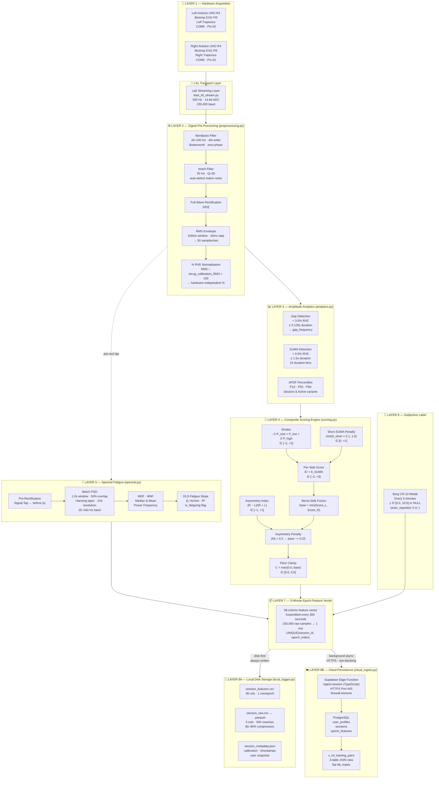
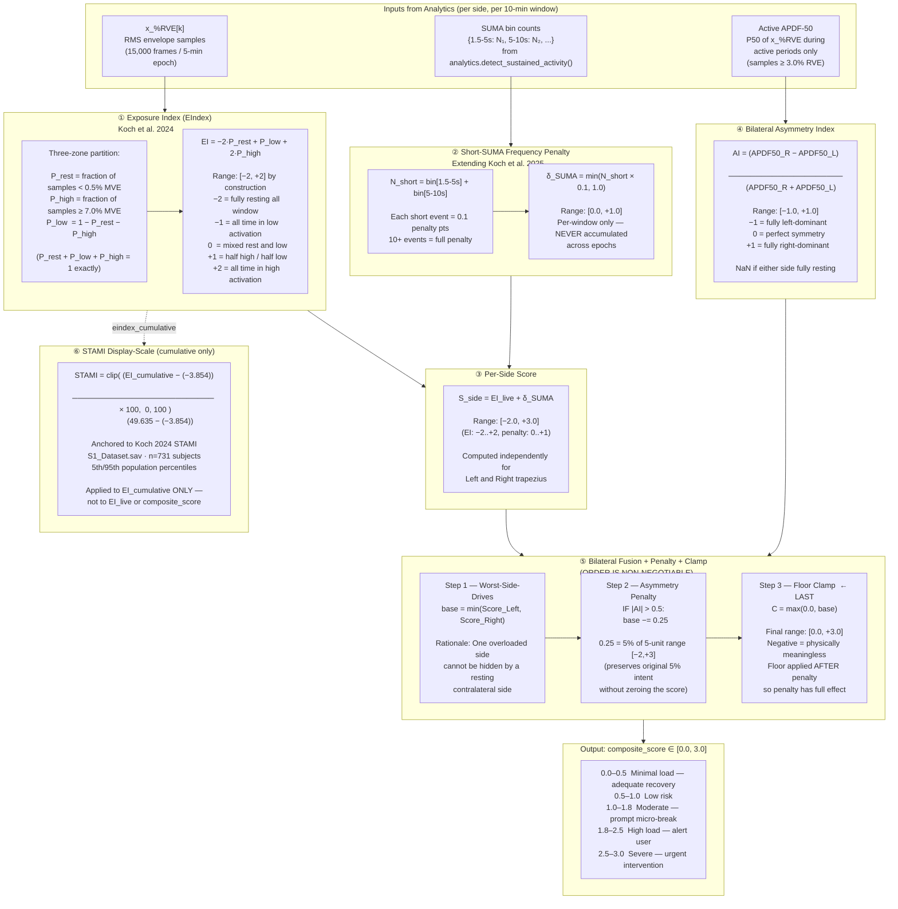
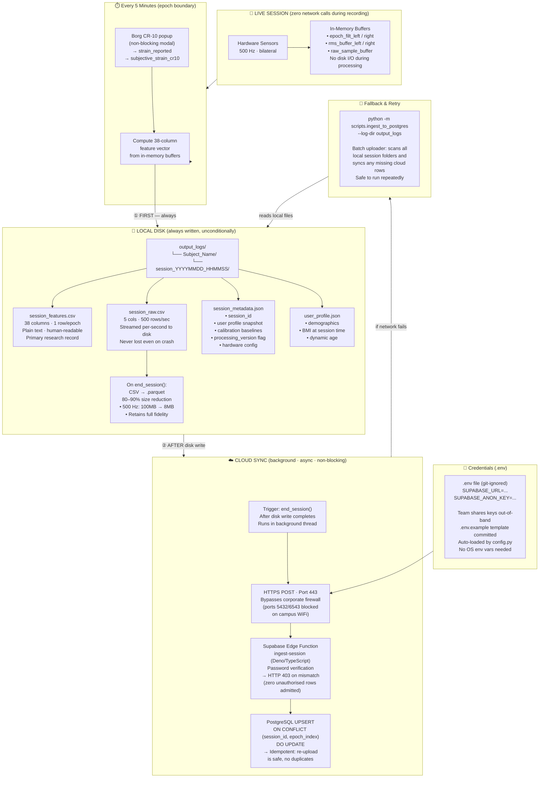
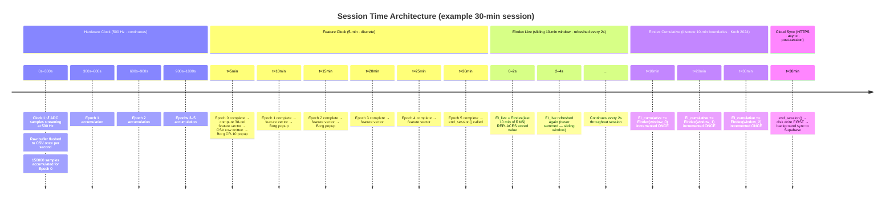

# TensionBudget — System Architecture Diagrams

**Version:** Phase 13 / W7 · 2026-08-05  
**Audience:** Professor review, academic presentation, research documentation

> This document contains five complementary architecture diagrams that together describe the full TensionBudget bilateral trapezius ergonomic surveillance system — from physical hardware through digital signal processing, live scoring, storage, cloud sync, and ML feature extraction.

---

## Diagram 1 — Full System Overview

*Top-level view of all layers: Hardware → Preprocessing → Analytics → Scoring → Storage → Cloud → ML*

---

## Diagram 2 — Real-Time Signal Processing Pipeline (Per Channel)

*Detailed transformation chain applied to each of the two independent EMG channels. Left and Right are never mixed before the asymmetry step.*

```mermaid
flowchart LR
    subgraph INPUT["Input"]
        RAW["x_raw[n]\nRaw ADC counts\n14-bit · 0–16383\n500 Hz"]
    end

    subgraph CONV["① ADC → mV\n(optional)"]
        VOLT["V_mV = (x / 16383)\n× V_ref × 1000\n\nSkipped for %RVE\nanalysis (ratios)"]
    end

    subgraph BPASS["② Bandpass Filter\nDe Luca 1997 / Farina 2002"]
        BPF["4th-order Butterworth\n20 Hz — 240 Hz\nZero-phase: sosfiltfilt\n(offline)\nCausal: sosfilt + z_i\n(live streaming)\n\nΩ_low = 20/250 = 0.08\nΩ_high = 240/250 = 0.96"]
    end

    subgraph SPECTAP["③ Pre-Rect\nSignal Tap"]
        TAP["x_filtered → Stage 5\nfor Welch PSD\n\nMust happen BEFORE\nrectification — |x|\ncreates 2f,3f harmonics\nthat invalidate MDF/MNF"]
    end

    subgraph NOTCH_F["④ Notch Filter\n(auto or manual)"]
        NF["IIR Notch · 50 Hz · Q=30\nBandwidth = f₀/Q = 1.67 Hz\nApplied only if PSD spike\nat 50 Hz > 5× median power"]
    end

    subgraph RECTF["⑤ Full-Wave Rectification"]
        RECT2["x_rect[n] = |x_filtered[n]|\n\nAll values ≥ 0\nPreserves instantaneous\namplitude envelope"]
    end

    subgraph RMSF["⑥ RMS Envelope\nMarker & Maluf 2016"]
        RMS2["RMS[k] = √( (1/W) Σ x²[n] )\n\nWindow W = 100ms = 50 samples\nStep S = 20ms = 10 samples\nOverlap = 80%\nOutput rate = 50 frames/sec\nN_frames per epoch ≈ 15,000"]
    end

    subgraph CALIB["⑦ % RVE Normalisation"]
        NORM["x_%RVE[k] = RMS[k] / RMS_ref × 100\n\nRMS_ref = mean RMS during\n5-second maximal shrug\n(stored in sessions table)\n\nResult: hardware-independent\ndimensionless % — enables\ncross-subject comparisons"]
    end

    subgraph OUT["Output to Analytics"]
        OUT1["x_%RVE[k] → analytics.py\n  • Gap detection (3.0% threshold)\n  • SUMA detection (0.5% threshold)\n  • APDF percentiles\n  • EIndex proportion counting"]
        OUT2["x_filtered[n] → spectral.py\n  • Welch PSD\n  • MDF / MNF\n  • OLS slope"]
    end

    INPUT --> CONV --> BPASS --> SPECTAP --> NOTCH_F --> RECTF --> RMSF --> CALIB --> OUT1
    SPECTAP -.->|pre-rect| OUT2
```

---

## Diagram 3 — Composite Scoring Engine

*All 5 steps of the scoring pipeline in order. Step order is architecturally non-negotiable.*

---

## Diagram 4 — Dual Storage Architecture & Cloud Sync

*How data flows from live capture to permanent local storage and then to cloud synchronisation. The architecture guarantees disk-first unconditional persistence.*

---

## Diagram 5 — Relational Database Schema (Entity-Relationship)

*The complete cloud database structure with all columns, types, constraints, and relationships. This is the schema as implemented in `cloud_schema.py`.*

```mermaid
erDiagram
    user_profiles {
        TEXT user_name PK "Anonymised bridge ID — only this crosses to research tables"
        TEXT birth_date "YYYY-MM-DD — age computed dynamically at query time"
        TEXT gender_sex "M / F / Other / Unspecified — sex moderates SUMA effects (Koch 2025)"
        REAL weight_kg "Used with height_cm to compute BMI = weight/(height/100)²"
        REAL height_cm "Standing height in cm"
        REAL updated_at "Unix timestamp of last profile update"
        TEXT password_hash "PBKDF2-SHA256 · 100k iterations — prevents unauthorised row injection"
        TEXT created_via "desktop_registration | web_registration"
    }

    sessions {
        TEXT session_id PK "user_name_YYYYMMDD_HHMMSS — unique per recording"
        TEXT user_name FK "FK → user_profiles — links session to subject"
        REAL start_time "Unix timestamp (float) — timezone-independent"
        TEXT start_time_str "YYYY-MM-DD HH:MM:SS — human-readable convenience"
        REAL end_time "NULL if session terminated abnormally (crash/power loss)"
        TEXT end_time_str "Human-readable end time"
        TEXT mode "live_lsl | replay | web — acquisition path stratifier"
        REAL calibration_rms_left "RMS during 5s shrug — denominator for left %RVE normalisation"
        REAL calibration_rms_right "RMS during 5s shrug — denominator for right %RVE normalisation"
        TEXT processing_version "phase11_edge_padding | legacy_constant_padding — ML covariate"
    }

    epoch_features {
        INTEGER feature_id PK "Auto-increment — no scientific meaning"
        TEXT session_id FK "FK → sessions"
        INTEGER epoch_index "0-based epoch counter · join key to _raw.csv"
        REAL elapsed_minutes "epoch_index × 5.0 — time axis for trend plots"
        REAL composite_score "Final ergonomic score ∈ [0.0, 3.0]"
        REAL eindex_live_left "EIndex sliding window · left ∈ [−2, +2]"
        REAL eindex_live_right "EIndex sliding window · right ∈ [−2, +2]"
        REAL eindex_cumulative_left "Session-total EIndex · left (Koch 2024 exact method)"
        REAL eindex_cumulative_right "Session-total EIndex · right"
        REAL short_suma_penalty_left "Short-SUMA freq penalty · left ∈ [0, 1]"
        REAL short_suma_penalty_right "Short-SUMA freq penalty · right ∈ [0, 1]"
        REAL total_suma_bursts_left "Total SUMA event count · left (all duration bins)"
        REAL total_suma_bursts_right "Total SUMA event count · right"
        REAL gap_frequency_left "Micro-rests per minute · left (≥0 · higher = better recovery)"
        REAL gap_frequency_right "Micro-rests per minute · right"
        REAL apdf_10_left "10th percentile %RVE · left (static load level)"
        REAL apdf_10_right "10th percentile %RVE · right"
        REAL apdf_50_left "50th percentile %RVE · left (median working load)"
        REAL apdf_50_right "50th percentile %RVE · right"
        REAL apdf_90_left "90th percentile %RVE · left (peak load level)"
        REAL apdf_90_right "90th percentile %RVE · right"
        REAL asymmetry_index_ai "AI=(R−L)/(R+L) ∈ [−1,+1] · NULL if either side resting"
        INTEGER asymmetry_penalty_applied "1 if |AI|>0.5 and 0.25pts subtracted · explainability flag"
        REAL mdf_hz_left "Median Power Frequency · left · Hz (20–240 band)"
        REAL mdf_hz_right "Median Power Frequency · right · Hz"
        REAL mnf_hz_left "Mean Power Frequency · left · Hz"
        REAL mnf_hz_right "Mean Power Frequency · right · Hz"
        REAL fatigue_slope_left "OLS dMDF/dt · left · Hz/min (negative = fatigue)"
        REAL fatigue_slope_right "OLS dMDF/dt · right · Hz/min"
        REAL mdf_r_squared_left "OLS R² · left (≥0.3 required to flag fatigue)"
        REAL mdf_r_squared_right "OLS R² · right"
        REAL n_windows_left "Active Welch windows used · left (quality metric)"
        REAL n_windows_right "Active Welch windows used · right"
        INTEGER mdf_computed_left "1=MDF available · 0=epoch too resting to compute"
        INTEGER mdf_computed_right "1=MDF available · 0=epoch too resting"
        INTEGER is_fatiguing_left "1 if slope<−0.3Hz/min AND R²≥0.30 · left"
        INTEGER is_fatiguing_right "1 if slope<−0.3Hz/min AND R²≥0.30 · right"
        INTEGER strain_reported "1=subject submitted Borg rating · 0=skipped (NEVER NULL)"
        REAL subjective_strain_cr10 "Borg CR-10 target label y ∈ [0.0–10.0] · NULL if not reported"
    }

    raw_telemetry_csv {
        INTEGER sample_index "Global 0-based sample counter from session start"
        REAL timestamp_s "Seconds since session start (float)"
        INTEGER epoch_index "JOIN KEY → epoch_features.epoch_index"
        INTEGER raw_adc_left "14-bit ADC value · left channel · 0–16383"
        INTEGER raw_adc_right "14-bit ADC value · right channel · 0–16383"
    }

    user_profiles ||--o{ sessions : "one subject → many sessions"
    sessions ||--o{ epoch_features : "one session → many 5-min epochs"
    epoch_features ||--o{ raw_telemetry_csv : "one epoch → 150,000 raw samples"
```

---

## Diagram 6 — Two-Clock Principle & EIndex Split

*Why EIndex is split into a live sliding window and a discrete cumulative counter — and how the 5-minute feature epoch fits into the broader time architecture.*

---

## Quick Reference — Key Parameters

| Layer | Parameter | Value | Source |
|---|---|---|---|
| Hardware | Sampling rate $f_s$ | **500 Hz** | Hardware |
| Hardware | ADC resolution | **14-bit** (UNO R4) | Hardware |
| Bandpass | Passband | **20 – 240 Hz** | De Luca 1997 |
| Bandpass | Filter order | **4th-order Butterworth** | Standard |
| Notch | Centre frequency | **50 Hz, Q=30** | India grid |
| RMS | Window | **100 ms = 50 samples** | Marker & Maluf 2016 |
| RMS | Step | **20 ms = 10 samples** | Marker & Maluf 2016 |
| Calibration | Duration | **5 seconds** (shrug) | Project design |
| Gap detection | Threshold | **3.0% RVE, ≥ 0.125 s** | Marker & Maluf 2016 |
| SUMA detection | Threshold | **0.5% RVE, ≥ 1.5 s** | Koch 2024 |
| EIndex | Rest zone | **< 0.5% MVE, weight −2** | Koch 2024 |
| EIndex | High zone | **≥ 7.0% MVE, weight +2** | Koch 2024 |
| Short-SUMA penalty | Per event | **0.1, cap 1.0** | Project extension |
| Asymmetry penalty | Threshold / points | **|AI| > 0.5 → −0.25 pts** | Project design |
| Composite score | Range | **[0.0, +3.0]** | Mathematical |
| STAMI anchors | 5th / 95th pctile | **−3.854 / +49.635** | Koch 2024, n=731 |
| Welch PSD | Window / overlap | **1.0 s / 50%** | Farina 2002 |
| Fatigue slope | Threshold | **−0.3 Hz/min (v1 placeholder)** | Extrapolated |
| Fatigue flag | Min R² | **0.30** | Project heuristic |
| Epoch interval | Feature emission | **5 minutes = 300 s** | Phase 10 lock |
| Epoch buffer | Raw samples | **150,000 per epoch** | $300 \times 500$ |
| Cloud transport | Protocol / port | **HTTPS / Port 443** | Firewall constraint |
| Auth | Hash algorithm | **PBKDF2-SHA256, 100k iter** | NIST SP 800-132 |

---

*All diagrams are derived directly from the implemented source code in `chordspy/tensionbudget/`. Parameter values are locked in `config.py` and propagate automatically to all modules — no magic numbers exist outside the config class.*
